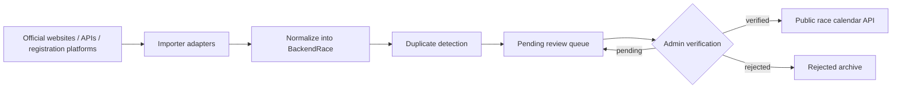

# Global Race Data Pipeline Architecture

The backend data layer is intentionally separate from the current frontend mock data. The current UI can keep reading `src/data/races.json`, while scrapers, API ingestors, and admin review tools use the backend model in `src/backend`.

## Pipeline Flow



## Backend Model

The primary model is `BackendRace` in `src/backend/race-model.ts`.

Required event fields:

- `id`
- `raceName`
- `slug`
- `country`
- `region`
- `city`
- `raceDate`
- `registrationOpenDate`
- `registrationCloseDate`
- `distances`
- `elevationGain`
- `organizer`
- `officialWebsite`
- `registrationUrl`
- `sourceUrl`
- `sourceName`
- `sourceType`
- `lastCheckedAt`
- `lastUpdatedAt`
- `verificationStatus`
- `dataConfidenceScore`
- `languages`
- `notes`

## Multiple Distances

Each race has `distances: BackendRaceDistance[]`.

Each distance supports:

- `id`
- `label`
- `distanceKm`
- `elevationGain`
- `startTime`
- `cutoffHours`
- distance-specific `registrationUrl`

The race-level `elevationGain` is calculated from the maximum distance elevation gain.

## Multiple Sources

Each race has `sources: BackendRaceSource[]`.

For compatibility with simple list views, the model also stores primary source fields:

- `sourceUrl`
- `sourceName`
- `sourceType`

These are derived from the first source when importing.

## Duplicate Detection

Duplicate detection uses:

```txt
normalized raceName + normalized country + normalized raceDate
```

The utility function is:

```ts
createDuplicateKey({ raceName, country, raceDate })
```

This catches common duplicate imports from official sites, registration platforms, and API providers.

## Review Safety

Scraped or API-imported data must never be published directly.

`createImportedRace()` always sets:

```ts
verificationStatus: "pending"
shouldPublish: false
```

Only races with `verificationStatus === "verified"` should be exposed through a public API.

Use:

```ts
getPublishableRaces(races)
```

## Future API Integration

Recommended API boundaries:

- `POST /api/admin/import-races`: accepts raw provider payloads and stores pending races.
- `GET /api/admin/races?status=pending`: admin review queue.
- `PATCH /api/admin/races/:id/verify`: marks a race verified or rejected.
- `GET /api/races`: public endpoint returning only verified races.
- `GET /api/races/:slug`: public detail endpoint returning one verified race.

The importer layer should store raw payloads separately and attach `rawPayloadUri` to each `BackendRaceSource`.
